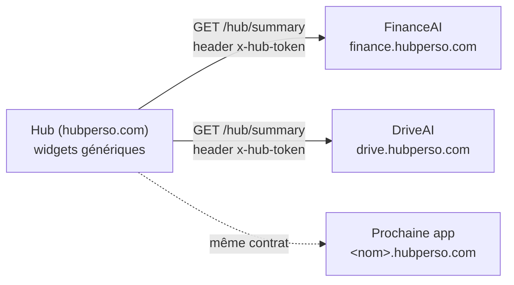

# hub-contract

Contrat d'intégration entre le hub perso (`hubperso.com`) et toutes les apps
(`finance.hubperso.com`, `drive.hubperso.com`, et les futures `<nom>.hubperso.com`).

Chaque app expose un endpoint `GET .../hub/summary` qui renvoie un JSON conforme
à ce contrat. Le hub consomme ces JSON et rend des widgets **100 % génériques** :
il ne connaît rien d'autre des apps que ce contrat.

Ce package est la **source de vérité** du contrat : types TypeScript + schémas
Zod de validation runtime. Rien d'autre — pas de logique métier, pas d'UI, pas
de fetch.



## Installation

```bash
npm install github:MoKarade/hub-contract#v1.0.0
```

Pas de publication npm : l'installation se fait directement depuis GitHub.
Le script `"prepare": "npm run build"` est exécuté par npm lors d'une install
git (devDependencies incluses), ce qui compile `dist/` à la volée. Seul `dist/`
est livré dans `node_modules`.

**Toujours pinner un tag** (`#v1.0.0`), jamais une branche : le contrat ne bouge
que par release explicite.

Fonctionne en CommonJS (`require`), en ESM (`import`) et dans un projet Vite —
l'exports map fournit les deux formats + les déclarations TypeScript.

## Utilisation

### Côté app (producteur)

```ts
import { HubSummarySchema, type HubSummary, CONTRACT_VERSION } from "@mokarade/hub-contract";

export async function GET(request: Request) {
  // 1. Auth — voir « Règles d'auth » plus bas.
  // 2. Construire le summary depuis les VRAIES données de l'app.
  const summary: HubSummary = {
    contractVersion: CONTRACT_VERSION,
    app: {
      id: "financeai",
      name: "FinanceAI",
      url: "https://finance.hubperso.com",
      color: "#0f766e",
    },
    generatedAt: new Date().toISOString(),
    status: "ok",
    metrics: [{ label: "Valeur nette", value: 123456.78, format: "currency", trend: 2.3 }],
    alerts: [],
    actions: [{ label: "Ouvrir FinanceAI", kind: "link", href: "https://finance.hubperso.com" }],
  };
  // 3. Valider avant d'envoyer : une app ne publie jamais un JSON non conforme.
  HubSummarySchema.parse(summary);
  return Response.json(summary, { headers: { "Cache-Control": "no-store" } });
}
```

App encore en développement ? Pas de fausses données — un summary honnête :

```ts
import { buildingSummary } from "@mokarade/hub-contract";

const summary = buildingSummary(
  { id: "driveai", name: "DriveAI", url: "https://drive.hubperso.com", color: "#2563eb" },
  { alertLabel: "DriveAI en construction — moteur pas encore actif" },
);
// → status "building", metrics [], une alerte info, actions []
```

### Côté hub (consommateur)

```ts
import { validateSummary, HUB_TOKEN_HEADER } from "@mokarade/hub-contract";

const response = await fetch("https://finance.hubperso.com/hub/summary", {
  headers: { [HUB_TOKEN_HEADER]: process.env.HUB_TOKEN! },
  cache: "no-store",
});
const summary = validateSummary(await response.json());
// jette une Error explicite listant chaque issue Zod si le JSON dévie du contrat
```

## Le contrat

Version courante : `CONTRACT_VERSION = 1`. Le champ `contractVersion` du JSON
doit être exactement cette valeur (`z.literal`) — un hub v1 rejette d'emblée un
summary v2.

### `HubSummary` (racine)

| Champ | Type | Règles |
|---|---|---|
| `contractVersion` | `1` | Littéral strict. |
| `app.id` | `string` | Kebab-case : `/^[a-z0-9-]+$/` (ex: `financeai`, `drive-ai`). |
| `app.name` | `string` | 1 à 30 caractères. |
| `app.url` | `string` | URL absolue de l'app. |
| `app.color` | `string` | Couleur d'accent du widget, hex 6 digits (`#0f766e`). |
| `generatedAt` | `string` | Datetime ISO 8601 **UTC** (suffixe `Z` obligatoire) — quand ce JSON a été généré. |
| `dataAsOf` | `string?` | Optionnel — fraîcheur des données sous-jacentes si différente de `generatedAt` (ex: dernière synchro). Même format UTC. |
| `status` | enum | `ok` \| `degraded` \| `error` \| `building` (`building` = app en dev, moteur pas actif). |
| `metrics` | array | Max **6** `HubMetric`. |
| `alerts` | array | Max **10** `HubAlert`. |
| `actions` | array | Max **6** `HubAction`. |

### `HubMetric`

| Champ | Type | Règles |
|---|---|---|
| `label` | `string` | 1 à 40 caractères. |
| `value` | `number \| string` | La valeur brute ; le hub formate selon `format`. |
| `format` | enum | `currency` \| `percent` \| `number` \| `text`. |
| `trend` | `number?` | Variation relative signée en % (ex: `+2.3`). |
| `severity` | enum? | `ok` \| `warn` \| `alert`. |

### `HubAlert`

| Champ | Type | Règles |
|---|---|---|
| `label` | `string` | 1 à 80 caractères. |
| `severity` | enum | `info` \| `warn` \| `alert`. |
| `href` | `string?` | URL absolue — deep link vers l'écran concerné dans l'app (un chemin relatif est rejeté). |

### `HubAction`

| Champ | Type | Règles |
|---|---|---|
| `label` | `string` | 1 à 40 caractères. |
| `kind` | enum | `link` = deep link (v1). `trigger` = webhook POST — **réservé v2, ne pas implémenter côté apps**. |
| `href` | `string` | URL cible absolue (un chemin relatif est rejeté). |
| `confirm` | `string?` | Si présent, le hub demande confirmation avant d'exécuter. |

### Précisions de validation

- **Datetimes en UTC uniquement.** `generatedAt` et `dataAsOf` exigent le
  suffixe `Z` : le `z.string().datetime()` de Zod 3 refuse les offsets
  (`+02:00`) et les datetimes sans timezone. Côté app, envoyer simplement
  `new Date().toISOString()`.
- **Clés inconnues strippées, pas rejetées.** Un champ absent du contrat est
  silencieusement retiré au parse. C'est le mécanisme qui rend l'évolution
  additive possible : un hub resté pinné en v1.0 tolère un summary produit
  par une app passée en v1.1 — le nouveau champ optionnel est ignoré.
  Comportement verrouillé par un test.
- **Schéma d'URL non restreint (v1).** `z.string().url()` accepte tout schéma
  (`https:`, mais aussi `javascript:`, `data:`, ...). Les apps sont de
  confiance, mais le hub doit quand même traiter `app.url` et les `href`
  comme des données : au rendu, n'autoriser que `http(s)` avant d'en faire
  des liens cliquables. Restreindre le schéma dans le contrat lui-même serait
  un breaking change (v2).

## Règles d'auth

- Le hub envoie le header **`x-hub-token`** (constante `HUB_TOKEN_HEADER`) à
  chaque requête.
- Une app **doit répondre 401** si le token est absent ou invalide. Pas de mode
  « ouvert », même en dev.
- Le token vit dans une variable d'environnement de chaque côté — jamais dans
  le code ni dans ce repo.
- Réponse toujours servie avec **`Cache-Control: no-store`** : un summary est
  un instantané, il ne doit être mis en cache ni par un CDN ni par le
  navigateur.

## CORS : rien à faire côté apps

Le hub fetch les summaries **server-side via son proxy** (le navigateur ne
parle jamais directement aux apps). Il n'y a donc **aucun header CORS à
configurer** sur les endpoints `/hub/summary`. Si tu te retrouves à ajouter du
CORS pour le hub, c'est que le fetch est parti côté client — c'est le bug à
corriger, pas le CORS à ouvrir.

## Développement local

```bash
npm install        # installe et build (via prepare)
npm run build      # tsup → dist/ (cjs + esm + .d.ts)
npm run test       # vitest
npm run typecheck  # tsc --noEmit (strict)
```

## Évolution du contrat

Les règles complètes (breaking change, changement additif, consommateurs à
re-pinner) sont dans [CLAUDE.md](./CLAUDE.md). L'état courant du repo et la
procédure de release sont dans [HANDOVER.md](./HANDOVER.md).
