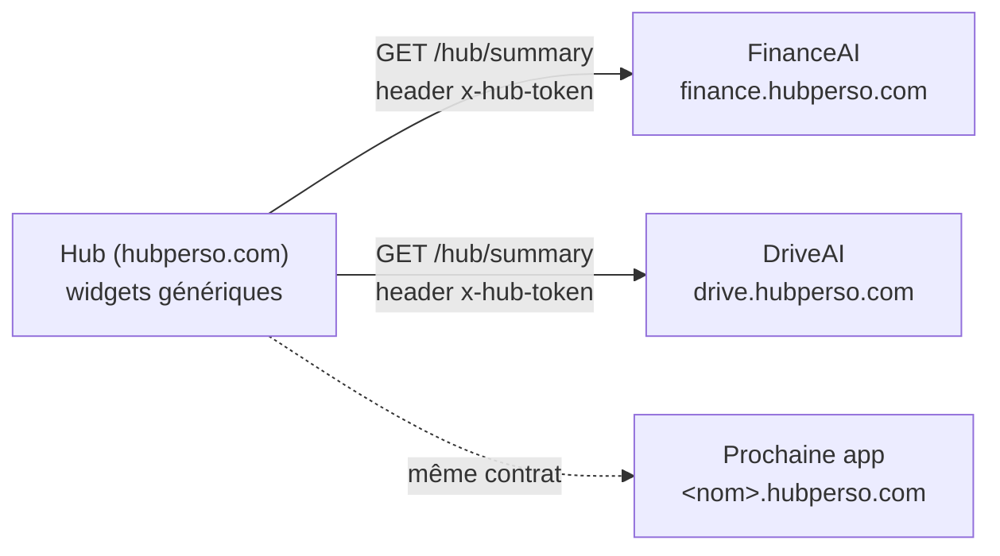

# hub-contract

Contrat d'intégration entre le hub perso (`hubperso.com`) et toutes les apps
(`finance.hubperso.com`, `drive.hubperso.com`, et les futures `<nom>.hubperso.com`).

Chaque app expose un endpoint `GET .../hub/summary` qui renvoie un JSON conforme
à ce contrat. Le hub consomme ces JSON et rend des widgets **100 % génériques** :
il ne connaît rien d'autre des apps que ce contrat.

Ce package est la **source de vérité** du contrat : types TypeScript + schémas
Zod de validation runtime. Rien d'autre — pas de logique métier, pas d'UI, pas
de fetch.



## Installation

```bash
npm install github:MoKarade/hub-contract#v1.3.1
```

Pas de publication npm : l'installation se fait directement depuis GitHub.
Depuis `v1.3.1`, `dist/` est **commité** : l'install fonctionne même en `--ignore-scripts`
(npm 11 / Node 24 n'y lance plus le `prepare` d'une dépendance git). Là où les scripts
tournent, `"prepare": "npm run build"` recompile le même `dist/`. Seul `dist/` est livré
dans `node_modules`. **Pinner `v1.3.1` ou plus** : `v1.3.0` et antérieurs ne livrent aucun
`dist/` à une CI en Node 24.

**Toujours pinner une référence immuable**, jamais une branche : le contrat ne bouge que
par release explicite.

### Ce que chaque tag apporte — et ce qu'un pin périmé fait perdre EN SILENCE

Les clés inconnues sont *strippées* et non rejetées. Un consommateur épinglé avant un champ
ne reçoit **aucune erreur** : le bloc disparaît simplement du summary. C'est le mode de panne
le plus discret de ce dépôt, et une instruction d'installation périmée suffit à le déclencher.

| Tag | Apporte | Ce qu'un pin antérieur perd, sans un mot |
|---|---|---|
| `v1.0.0` | Le contrat de base. | — |
| `v1.1.0` | Bloc `usage` (coûts & quotas). | Tout suivi de coût. |
| `v1.2.0` | `ContractTooNewError` (version sondée avant la structure). | Le bon diagnostic : un summary trop récent s'affiche « invalide », ce qui accuse l'app au lieu du hub. |
| `v1.3.0` | `details`, `primary`, `recommendation`, `expectedMaxAgeSec`. | La vue détaillée, la désignation du chiffre principal, la recommandation, et toute détection de donnée figée. |
| `v1.3.1` | Même contrat que `v1.3.0`, `dist/` commité. | L'installation elle-même sous Node 24 + `--ignore-scripts` (module introuvable). |

Fonctionne en CommonJS (`require`), en ESM (`import`) et dans un projet Vite —
l'exports map fournit les deux formats + les déclarations TypeScript.

## Utilisation

### Côté app (producteur)

```ts
import { HubSummarySchema, type HubSummary, CONTRACT_VERSION } from "@mokarade/hub-contract";

export async function GET(request: Request) {
  // 1. Auth — voir « Règles d'auth » plus bas.
  // 2. Construire le summary depuis les VRAIES données de l'app.
  const summary: HubSummary = {
    contractVersion: CONTRACT_VERSION,
    app: {
      id: "financeai",
      name: "FinanceAI",
      url: "https://finance.hubperso.com",
      color: "#0f766e",
    },
    generatedAt: new Date().toISOString(),
    status: "ok",
    metrics: [{ label: "Valeur nette", value: 123456.78, format: "currency", trend: 2.3 }],
    alerts: [],
    actions: [{ label: "Ouvrir FinanceAI", kind: "link", href: "https://finance.hubperso.com" }],
  };
  // 3. Valider avant d'envoyer : une app ne publie jamais un JSON non conforme.
  HubSummarySchema.parse(summary);
  return Response.json(summary, { headers: { "Cache-Control": "no-store" } });
}
```

App encore en développement ? Pas de fausses données — un summary honnête :

```ts
import { buildingSummary } from "@mokarade/hub-contract";

const summary = buildingSummary(
  { id: "driveai", name: "DriveAI", url: "https://drive.hubperso.com", color: "#2563eb" },
  { alertLabel: "DriveAI en construction — moteur pas encore actif" },
);
// → status "building", metrics [], une alerte info, actions []
```

### Côté hub (consommateur)

```ts
import { validateSummary, HUB_TOKEN_HEADER } from "@mokarade/hub-contract";

const response = await fetch("https://finance.hubperso.com/hub/summary", {
  headers: { [HUB_TOKEN_HEADER]: process.env.HUB_TOKEN! },
  cache: "no-store",
});
const summary = validateSummary(await response.json());
// jette une Error explicite listant chaque issue Zod si le JSON dévie du contrat
```

## Le contrat

Version courante : `CONTRACT_VERSION = 1`, paquet **`1.3.0`**.

Le champ `contractVersion` du JSON n'est **pas** un littéral strict — il l'a été jusqu'à la
v1.1. C'est un entier `>= 1`, sondé **avant** la structure : un consommateur qui reçoit une
version qu'il ne sait pas lire lève un `ContractTooNewError` distinct (« l'app est en avance,
re-pinne le consommateur ») au lieu de « summary invalide », qui accusait le mauvais dépôt.
Voir « Deux modes d'échec » plus bas.

### `HubSummary` (racine)

| Champ | Type | Règles |
|---|---|---|
| `contractVersion` | `number` | Entier ≥ 1. Actuellement `1`. |
| `app.id` | `string` | Kebab-case : `/^[a-z0-9-]+$/` (ex: `financeai`, `drive-ai`). |
| `app.name` | `string` | 1 à 30 caractères. |
| `app.url` | `string` | URL absolue de l'app. |
| `app.color` | `string` | Couleur d'accent du widget, hex 6 digits (`#0f766e`). |
| `generatedAt` | `string` | Datetime ISO 8601 **UTC** (suffixe `Z` obligatoire) — quand ce JSON a été généré. |
| `dataAsOf` | `string?` | Optionnel — fraîcheur des données sous-jacentes si différente de `generatedAt` (ex: dernière synchro). Même format UTC. |
| `expectedMaxAgeSec` | `number?` | Optionnel (v1.3) — âge maximal **normal** de `dataAsOf`, en secondes. Entier > 0, ≤ 2 592 000 (30 j). **Exige `dataAsOf`.** Voir ci-dessous. |
| `status` | enum | `ok` \| `degraded` \| `error` \| `building` (`building` = app en dev, moteur pas actif). |
| `metrics` | array | Max **6** `HubMetric`. Au plus **une** peut porter `primary: true`. |
| `alerts` | array | Max **10** `HubAlert`. |
| `actions` | array | Max **6** `HubAction`. |
| `details` | array? | Optionnel (v1.3) — max **6** `HubDetailSection`, la vue détaillée. Voir ci-dessous. |
| `recommendation` | object? | Optionnel (v1.3) — LA prochaine chose à faire. Voir `HubRecommendation`. |
| `usage` | object? | Optionnel (v1.1) — coûts & quotas. Voir `HubUsage` ci-dessous. |

### `HubMetric`

| Champ | Type | Règles |
|---|---|---|
| `label` | `string` | 1 à 40 caractères. |
| `value` | `number \| string` | La valeur brute ; le hub formate selon `format`. |
| `format` | enum | `currency` \| `percent` \| `number` \| `text`. |
| `trend` | `number?` | Variation relative signée en % (ex: `+2.3`). |
| `severity` | enum? | `ok` \| `warn` \| `alert`. |
| `primary` | `boolean?` | Optionnel (v1.3) — cette métrique est **LE** chiffre de l'app, celui qui porte la grande tuile du hub. Au plus une par summary, sinon le summary est rejeté. Sans elle, le hub retombe sur la première métrique. |

### `HubDetailSection` / `HubDetailItem` (v1.3, optionnel)

`metrics` est plafonné à **6** pour que la carte reste lisible. Ce plafond n'avait aucune
raison de borner ce qu'on peut consulter **en cliquant** : `details` est cette vue-là. Des
sections titrées, chacune portant ses lignes.

| Champ | Type | Règles |
|---|---|---|
| `details[].title` | `string` | 1 à 40 caractères. **Unique** parmi les sections. |
| `details[].items` | array | **1** à **8** `HubDetailItem` — une section vide est rejetée (un titre au-dessus de rien). |
| `items[].label` | `string` | 1 à 40 caractères. **Unique dans sa section.** |
| `items[].value` | `number \| string` | Comme `HubMetric.value`. |
| `items[].format` | enum | `currency` \| `percent` \| `number` \| `text`. |
| `items[].trend` | `number?` | Variation relative signée en %. |
| `items[].severity` | enum? | `ok` \| `warn` \| `alert`. |
| `items[].hint` | `string?` | Max 80 — l'unité, la période, la base d'un pourcentage. Ce qui empêche « +4,2 % » d'être ambigu. |

Une ligne de détail **ne peut pas** porter `primary` : le champ est absent de son schéma, donc
silencieusement retiré. Promouvoir un détail en titre de carte contournerait le plafond de 6.

#### ⚠️ Pourquoi les libellés doivent être uniques

Le hub garde une mémoire des relevés pour tracer l'évolution d'une valeur dans le temps, et il
retrouve une série **par son libellé**. La clé est le couple **(titre de section, libellé)** :

- deux sections homonymes, ou deux lignes homonymes dans la **même** section → **rejetées** ;
- le même libellé dans **deux sections différentes** → **accepté**, et c'est même la forme la
  plus lisible (« Placements » sous « Aujourd'hui » et sous « Depuis le début »).

Sans cette règle, deux lignes homonymes donneraient une courbe qui saute d'une grandeur à
l'autre : un graphe faux, avec rien d'anormal à l'écran.

### `HubRecommendation` (v1.3, optionnel)

| Champ | Type | Règles |
|---|---|---|
| `label` | `string` | 1 à 80 — l'action, à l'impératif et chiffrée quand c'est possible. |
| `why` | `string?` | 1 à 140 — pourquoi, en une phrase. Une recommandation sans raison ne se vérifie pas. |
| `href` | `string?` | URL absolue vers l'écran où l'on fait la chose. |

**Une seule, pas un tableau** — volontairement. Un tableau serait rempli de cinq conseils
classés par une app qui ne voit qu'elle-même, et un tableau de bord qui en affiche cinq n'en
affiche aucune : le lecteur arbitre, donc ne fait rien. Le producteur est obligé de choisir,
ce qui est exactement le travail qu'on lui demande.

**Ce n'est pas une alerte, et il ne faut pas les confondre.** Une alerte dit *ce qui va mal* ;
une recommandation dit *ce qu'il y a de mieux à faire*, et le plus souvent rien ne va mal. Les
fondre laisse deux issues, mauvaises toutes les deux : soit un bon conseil s'affiche avec la
mise en forme d'un problème, soit la liste des problèmes se dilue de conseils et on apprend à
ne plus la lire.

### `expectedMaxAgeSec` (v1.3, optionnel) — déclarer son propre rythme

Le hub voit `dataAsOf`, mais il ne sait pas si sa valeur est bonne ou mauvaise. « 40 min » est
sain pour un véhicule qui se rafraîchit aux 30-60 min, et catastrophique pour un moteur qui
passe aux 5 min. Faute de le savoir, le hub ne pouvait que **deviner** — donc se tromper pour
au moins une app, et un seuil deviné côté hub serait de la connaissance d'app codée en dur,
exactement ce que ce contrat existe pour éviter.

Avec ce champ, c'est l'app qui déclare son rythme et le hub ne fait que comparer. Il peut
alors distinguer, sans rien savoir du métier : donnée fraîche · donnée **figée** au-delà du
normal · fraîcheur **non déclarée**.

```ts
dataAsOf: derniereMesure.toISOString(),
expectedMaxAgeSec: 3600,   // « au-delà d'une heure, ma donnée est en retard »
```

**Ce qu'il ne promet pas** : un âge dépassé n'est pas une panne, c'est un retard *observable*.
Le producteur déclare un rythme attendu, pas une garantie.

⚠️ **Sans `dataAsOf`, le summary est rejeté.** Un âge attendu sans horodatage à comparer ne
mesure rien, et serait pire qu'inutile : le producteur croirait sa fraîcheur surveillée alors
que le hub n'aurait rien à surveiller — un faux sentiment de surveillance, invisible des deux
côtés.

⚠️ **Une horloge d'app en avance rend toute donnée éternellement fraîche.** Le contrat
n'interdit pas un `dataAsOf` dans le futur (le rejeter accuserait de panne une app qui a
simplement 2 s de dérive). C'est donc au consommateur de traiter « mesuré dans le futur »
comme un état à part, et au producteur de n'horodater que des mesures réelles — jamais
`new Date()` faute de mieux. Un `dataAsOf` égal à `generatedAt` « pour remplir le champ »
annonce une fraîcheur à la seconde qui n'existe pas.

### `HubAlert`

| Champ | Type | Règles |
|---|---|---|
| `label` | `string` | 1 à 80 caractères. |
| `severity` | enum | `info` \| `warn` \| `alert`. |
| `href` | `string?` | URL absolue — deep link vers l'écran concerné dans l'app (un chemin relatif est rejeté). |

### `HubAction`

| Champ | Type | Règles |
|---|---|---|
| `label` | `string` | 1 à 40 caractères. |
| `kind` | enum | `link` = deep link (v1). `trigger` = webhook POST — **réservé v2, ne pas implémenter côté apps**. |
| `href` | `string` | URL cible absolue (un chemin relatif est rejeté). |
| `confirm` | `string?` | Si présent, le hub demande confirmation avant d'exécuter. |

### `HubUsage` (v1.1, optionnel)

Ce que l'app dépense et ce qu'elle consomme. **Tout est optionnel** : une app qui ne suit
rien omet le bloc entier, et le hub l'affiche « non suivie » — jamais un 0 inventé.

| Champ | Type | Règles |
|---|---|---|
| `cost.amount` | `number` | Montant dépensé, ≥ 0. |
| `cost.currency` | enum | `USD` \| `CAD`. Le hub convertit en CAD pour l'affichage. |
| `cost.period` | enum | `total` (cumulé depuis toujours) \| `mois` (mois courant) \| `jour` (aujourd'hui). |
| `quotas` | array | Max **10** `HubQuota`. |

### `HubQuota`

| Champ | Type | Règles |
|---|---|---|
| `label` | `string` | 1 à 40 caractères. |
| `used` | `number` | Quantité consommée sur la période, ≥ 0. |
| `limit` | `number \| null` | Plafond connu, > 0 ; **`null`** si l'app ne connaît pas de limite chiffrée — jamais un plafond inventé pour faire une jolie jauge. |
| `unit` | `string?` | Max 20 caractères (ex: `appels`, `Go`, `courriels`). |
| `resetAt` | `string?` | Datetime ISO 8601 UTC — quand le compteur se réinitialise. |

#### ⚠️ Le hub ne fusionne JAMAIS deux `period` différentes

C'est la règle la plus importante de ce bloc, et la seule qui puisse produire un chiffre faux
sans que rien ne casse.

Le hub somme les `cost` **par période** et affiche un montant par période, avec son étiquette.
Il n'existe volontairement **aucun total global** : additionner un cumul et un mois courant
donne un nombre qui n'existe pas — et qui est **sous-estimé**, puisqu'il manque les mois
passés de l'app qui déclare `mois`.

Ce n'est pas théorique : ça a été affiché en production comme « cumulé » jusqu'au correctif du
31/07/2026 (`Hubperso/lib/usage.ts`, `aggregateUsage` → `totalsByPeriod`, sans `totalCad`).

**Ce que ça demande à un producteur** : choisir la `period` qui décrit *vraiment* le montant,
pas celle qui l'affiche le mieux. Publier un mois courant sous `total` n'est pas un arrondi —
c'est un chiffre juste rangé sous une étiquette fausse, et le hub l'additionnera avec les
cumuls des autres apps.

**Si les deux valeurs existent** : publier le **cumul** en `cost`, et mettre le mois dans un
`quota` avec son plafond pour `limit`. Rien n'est perdu — la distance au plafond est même plus
informative qu'un montant nu — et le hub peut afficher un seul montant honnête. C'est ce que
fait DriveAI.

### Précisions de validation

- **Datetimes en UTC uniquement.** `generatedAt` et `dataAsOf` exigent le
  suffixe `Z` : le `z.string().datetime()` de Zod 3 refuse les offsets
  (`+02:00`) et les datetimes sans timezone. Côté app, envoyer simplement
  `new Date().toISOString()`.
- **Clés inconnues strippées, pas rejetées.** Un champ absent du contrat est
  silencieusement retiré au parse. C'est le mécanisme qui rend l'évolution
  additive possible : un hub resté pinné en v1.0 tolère un summary produit
  par une app passée en v1.1 — le nouveau champ optionnel est ignoré.
  Comportement verrouillé par un test.
- **Schéma d'URL non restreint (v1).** `z.string().url()` accepte tout schéma
  (`https:`, mais aussi `javascript:`, `data:`, ...). Les apps sont de
  confiance, mais le hub doit quand même traiter `app.url` et les `href`
  comme des données : au rendu, n'autoriser que `http(s)` avant d'en faire
  des liens cliquables. Restreindre le schéma dans le contrat lui-même serait
  un breaking change (v2).

## Règles d'auth

- Le hub envoie le header **`x-hub-token`** (constante `HUB_TOKEN_HEADER`) à
  chaque requête.
- Une app **doit répondre 401** si le token est absent ou invalide. Pas de mode
  « ouvert », même en dev.
- Le token vit dans une variable d'environnement de chaque côté — jamais dans
  le code ni dans ce repo.
- Réponse toujours servie avec **`Cache-Control: no-store`** : un summary est
  un instantané, il ne doit être mis en cache ni par un CDN ni par le
  navigateur.

## CORS : rien à faire côté apps

Le hub fetch les summaries **server-side via son proxy** (le navigateur ne
parle jamais directement aux apps). Il n'y a donc **aucun header CORS à
configurer** sur les endpoints `/hub/summary`. Si tu te retrouves à ajouter du
CORS pour le hub, c'est que le fetch est parti côté client — c'est le bug à
corriger, pas le CORS à ouvrir.

## Développement local

```bash
npm install        # installe et build (via prepare)
npm run build      # tsup → dist/ (cjs + esm + .d.ts)
npm run test       # vitest
npm run typecheck  # tsc --noEmit (strict)
```

## Évolution du contrat

Les règles complètes (breaking change, changement additif, consommateurs à
re-pinner) sont dans [CLAUDE.md](./CLAUDE.md). L'état courant du repo et la
procédure de release sont dans [HANDOVER.md](./HANDOVER.md).

## Deux modes d'échec, et ils ne disent pas la même chose

`validateSummary` juge la **version avant la structure**, et jette deux choses différentes :

| Ce qui est jeté | Ce que ça veut dire | Qui doit agir |
|---|---|---|
| `ContractTooNewError` | L'app publie une version que ce build ne lit pas. | **Le consommateur** : re-pinner le hub. |
| `Error` | Le payload est hors contrat. | **L'app** : le message liste chaque issue Zod. |

Avant la v1.2.0, `contractVersion` était un `z.literal` : un summary v2 levait la même erreur
qu'un JSON malformé, et le hub affichait « invalide » — ce qui accuse l'app alors que c'est le
hub qui est en retard d'un re-pin.

Plus grave : avec un littéral, **hub et apps doivent basculer au même instant.** Il n'existe
aucune fenêtre où les deux versions coexistent, donc aucun ordre de déploiement valide. Un
contrat qui interdit sa propre évolution finit par ne jamais évoluer.

L'ordre compte : une version majeure peut légitimement retirer un champ, donc parser la
structure d'abord ferait sortir « invalide » et le vrai diagnostic serait perdu.

## `@mokarade/hub-contract/endpoint` — le endpoint écrit une fois

```ts
import { serveSummary, HUB_TOKEN_HEADER } from "@mokarade/hub-contract/endpoint";

export async function GET(request: Request) {
  const r = await serveSummary(
    { method: request.method, token: request.headers.get(HUB_TOKEN_HEADER) },
    { expectedToken: process.env.HUB_TOKEN, build: construireSummary },
  );
  return new Response(r.body, { status: r.status, headers: r.headers });
}
```

Il applique le contrat de bout en bout, **dans cet ordre** : méthode (405), configuration
(503), autorisation (401), construction (500 si elle jette), validation avant émission (200).

L'ordre n'est pas indifférent. Vérifier le jeton avant la configuration répondrait 401 à un
appelant parfaitement légitime quand c'est l'app qui n'a rien de branché — et on chercherait un
problème d'authentification là où il n'y a rien à trouver.

Le module est **sans framework** (ni `Request`, ni `next/server`) : une route Next, une fonction
serverless et un test unitaire appellent la même fonction. La comparaison de jeton passe par un
digest SHA-256 puis un XOR sur toute la longueur — `crypto.subtle` plutôt que `timingSafeEqual`,
qui est propre à Node et absent du runtime Edge.

⚠️ Inutilisable depuis un `api/` déclaré « zéro dépendance npm » (le broker DriveAI). Ce n'est
pas un oubli : cette contrainte-là est un choix de ce dépôt-là.
